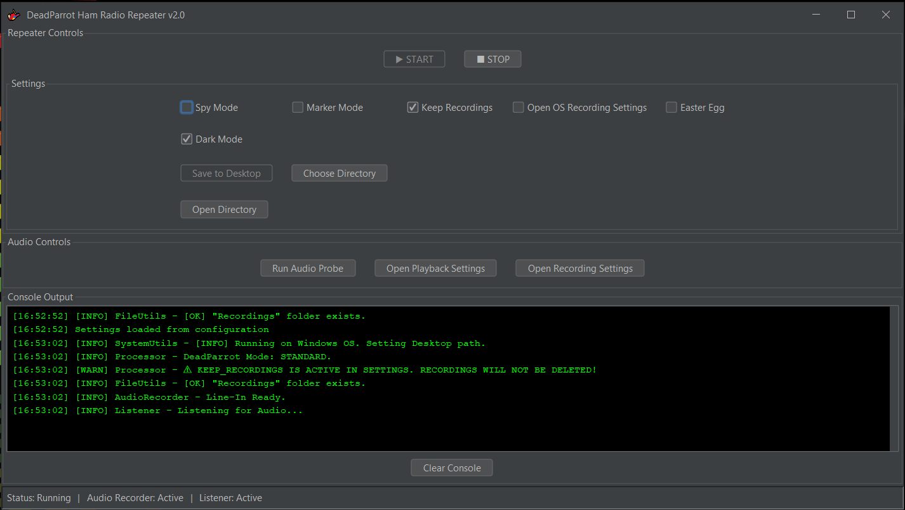
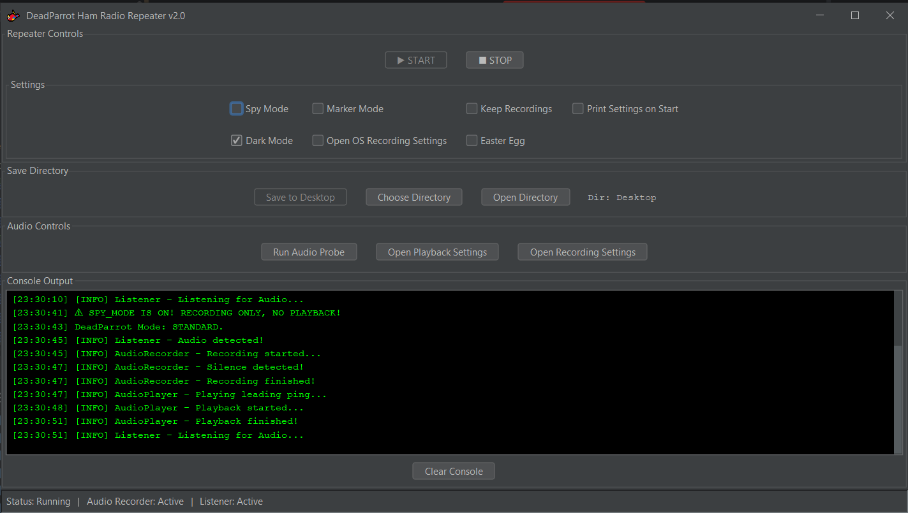
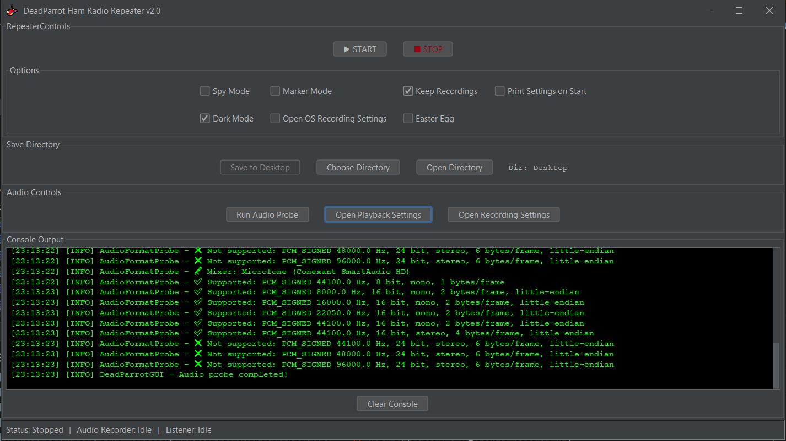

#  DeadParrot

**DeadParrot** is a modern Java-based audio repeater designed for amateur radio enthusiasts. It listens for audio input, records the audio for a defined period or until silence is detected, and then plays back the same recording — just like a parrot!

This project mimics the behavior of a repeater station by automatically handling sound detection, recording, and playback, with minimal setup. Perfect for testing transmit audio quality, channel monitoring, or silent radio surveillance.

**Version:** 2.0.0 | **Status:** Active Development

---

## 📸 Screenshots
<p align="center">
  
  
  
</p>

---

## ⚡ Quick Start

### System Requirements
- **Java 21+** – Required runtime environment
- **Operating System** – Windows or Linux (cross-platform support)
- **Audio Hardware** – Microphone input and speaker output

### Installation
1. Clone this repository or download the latest release JAR file
2. Ensure Java 21 is installed: `java -version`
3. Run the application:
   ```bash
   java -jar deadparrot-2.0.0-SNAPSHOT.jar
   ```

### First Run
1. Launch the application – the GUI will appear
2. Select your **Input Device** and **Output Device** from the dropdowns
3. Click **START** to begin monitoring for audio
4. Speak or transmit into your microphone – the application will record and play back automatically

---

## 🎯 Features

- 🎙️ **Sound Detection** – Begins recording only when sound is detected via threshold analysis.
- ⏺️ **Smart Recording** – Automatically stops recording after a period of silence or a max duration.
- 📁 **WAV File Output** – Saves recordings as standard `.wav` files with flexible output paths.
- 🔊 **Playback Support** – Plays back the recorded audio after a short leading "ping" sound.
- 🧠 **Threaded Design** – Handles recording and playback on separate threads to ensure responsive performance.
- 🎯 **Audio Device Selection** – Choose specific input/output devices and audio formats from dropdown menus (NEW in v2.0).
- 🕵️ **Spy Mode** – A silent monitoring mode that records transmissions without playing them back.
- 🎙️ **Marker Mode** – Plays a periodic marker sound (configurable interval) for channel monitoring.
- 🖥️ **Modern GUI** – Full graphical interface with FlatLaf support, featuring dark/light themes, real-time console output, and configurable settings.
- 🌙 **Dark & Light Mode** – Toggle between dark and light UI themes.
- 📋 **Menu Bar Integration** – Access audio tools and settings from the menu bar.
- 🖴 **Cross-Platform Support** – Runs on Windows and Linux with automatic OS detection.
- 🎁 **Easter Egg** – Monty Python-style parrot quotes on shutdown for fun!
- 📂 **Flexible Storage** – Save recordings locally or to desktop folder, with options to keep or delete after playback.

---

## 🛠️ Project Structure

### Core Components
- **`Main.java`** – Application entry point; launches either the GUI or console-based processor based on settings.
- **`DeadParrotGUI.java`** – Full-featured graphical user interface with Swing/FlatLaf framework.
- **`Processor.java`** – Main coordinator that initializes components and manages the application lifecycle.
- **`AudioRecorder.java`** – Manages microphone input, records sound, detects silence, and writes to a WAV file.
- **`AudioPlayer.java`** – Plays the recorded audio, leading ping sound, and marker sounds.
- **`Listener.java`** – Constantly monitors for sound to trigger the recording process.
- **`AudioMarker.java`** – Handles marker mode operation with periodic marker playback.
- **`Settings.java`** – Centralized configuration management for all application settings.
- **`Constants.java`** – Central repository for constant strings and system messages.

### Utility Classes
- **`AudioDeviceManager.java`** – Discovers and manages available audio input/output devices and formats.
- **`FileUtils.java`** – Handles directory creation, OS detection, and file operations.
- **`AudioResourcesPreloader.java`** – Preloads audio resources from JAR to temp files.
- **`WaveWriterUtil.java`** – Manages WAV file header writing and audio data serialization.
- **`ParrotQuotes.java`** – Provides Monty Python-style parrot quotes for the Easter egg feature.
- **`SoundSettingsOpener.java`** – Opens OS sound recording settings on Windows/Linux.
- **`Printer.java`** – Utility for printing current settings to console.
- **`AudioFormatProbe.java`** – Audio format detection utilities.
- **`ListInputDevices.java`** – Lists available audio input devices.
- **`SettingsPersistence.java`** – Persists user settings to configuration file.

---

## 🔧 Configuration

DeadParrot is configured via the **`Settings.java`** class with the following main options:

### Operating Mode
- **`USE_GUI`** – Enable GUI mode (default: `true`). Set to `false` to run in console-only mode.

### Audio Configuration
- **`AUDIO_FORMAT`** – Standard audio format: PCM signed, 44.1kHz, 16-bit, stereo (read-only).
- **`SOUND_DETECTION_SENSITIVITY`** – Threshold for detecting sound (default: 5000). Higher values require louder audio.
- **`SILENCE_THRESHOLD`** – Amplitude threshold below which audio is considered silence (default: 500).
- **`SILENCE_DURATION_MS`** – Duration of continuous silence before stopping recording (default: 1500ms).
- **`MAX_RECORDING_TIME_MS`** – Maximum recording duration (default: 60000ms / 60 seconds).

### Operating Modes
- **`SPY_MODE`** – Enable spy mode: record only, no playback (default: `false`).
- **`MARKER_MODE`** – Enable marker mode: plays periodic marker sounds instead of repeating (default: `false`).
- **`MARKER_TIME`** – Interval between marker sounds in milliseconds (default: 50000ms / 5 minutes).
- **`PLAY_MARKER`** – Option to play markers during standard mode operation (default: `false`).

### Recording & Storage
- **`KEEP_RECORDINGS`** – Keep all recordings permanently (default: `true`). If `false`, recordings are deleted after playback.
- **`SAVE_RECORDINGS_TO_DESKTOP`** – Save files to Desktop/Recordings instead of local Recordings folder (default: `true`).

### Audio Device Selection (v2.0+)
- **`SELECTED_INPUT_DEVICE`** – Name of the selected audio input device (default: system default).
- **`SELECTED_OUTPUT_DEVICE`** – Name of the selected audio output device (default: system default).
- **`SELECTED_AUDIO_FORMAT`** – Selected audio format as a string (default: system default).
- Audio device selections are persistent and saved to the `deadparrot.settings` file.
- Dropdown menus in the GUI automatically populate with available devices on your system.

### User Interface & Features
- **`OPEN_OS_RECORDING_SETTINGS`** – Opens the OS sound recording settings on startup (default: `true`).
- **`DARK_MODE`** – Enable dark theme for the GUI (default: `true`).
- **`EASTER_EGG`** – Enable Monty Python parrot quotes on shutdown (default: `false`).
- **`PRINT_SETTINGS`** – Print all settings to console on startup (default: `false`).

These settings can be modified directly in `Settings.java` or through the GUI interface when running in GUI mode.  

---

## 🪛 Dependencies

This project uses:

- **Java 21** – Core language (compiled with target version 21)
- **Java Sound API** (`javax.sound.sampled`) – For audio input/output operations
- **Lombok** (`@Slf4j`) – For simplified logging and reducing boilerplate code
- **SLF4J** (v2.0.16) – Logging facade
- **Logback Classic** (v1.5.13) – SLF4J implementation for advanced logging
- **FlatLaf** (v3.5.4) – Modern look-and-feel library for Swing GUI with light/dark theme support
- Custom utility classes for audio device management, WAV file handling, and cross-platform support

---

## 🚀 How It Works

### Standard Mode (Default Repeater Behavior)

1. `Listener` continuously monitors the audio input for audio that exceeds a defined threshold.
2. When sound is detected:
   - `AudioRecorder` records until silence is detected or the max time elapses.
   - The recorded audio is saved as a WAV file.
3. After recording:
   - A "ping" sound is played (helps to trigger VOX on radios in time for the full file to be played back).
   - The recorded audio is played back through the computer audio output.

### Spy Mode (Silent Recording)

- Same as Standard Mode, but the recorded audio is **not** played back.
- Useful for monitoring and logging radio transmissions without transmission.
- Recordings are automatically kept (cannot be deleted).

### Marker Mode (Channel Monitoring Beacon)

- Instead of repeating transmissions, a periodic marker sound is played at configurable intervals (default: 5 minutes).
- Useful for continuously monitoring a channel without the repeater aspect.
- Does not record user audio.

### User Interface

When `USE_GUI = true` (default), a full graphical interface is available featuring:
- **Menu Bar** – Access audio tools and system settings from the top menu bar.
- **Start/Stop Controls** – Begin and stop the repeater operation.
- **Audio Device Selection Panel** – Dropdown menus to choose input device, output device, and audio format.
- **Settings Panel** – Toggle operating modes, storage options, and UI preferences in real-time.
- **Console Output** – View all logs and system messages with timestamps.
- **Status Indicators** – Real-time status of the repeater, recorder, and listener components.
- **Audio Controls** – Quick buttons for audio probe, playback settings, and recording settings.
- **Theme Support** – Switch between dark and light modes.
- **Emergency Close** – Safe shutdown with confirmation if the repeater is running.

---

## 🔄 Typical Use Cases

### 1. **Amateur Radio Repeater (Simplex)**
   - Acts as a voice repeater that listens for incoming transmissions and repeats them back.
   - Ideal for amateur radio simplex operations on a single frequency.

### 2. **Channel Monitoring**
   - Use Marker Mode to periodically monitor that you're still on frequency.
   - Confirms channel is active without transmitting actual traffic.

### 3. **Voice Test Repeater (Parrot)**
   - Test your radio transmit and audio quality by having your transmissions echoed back.
   - Perfect for testing audio settings in amateur radio setups.

### 4. **Silent Radio Surveillance & Logging (Spy Mode)**
   - Record radio transmissions without playing them back.
   - Ideal for emergency dispatch monitoring, frequency logging, or silent radio surveillance.
   - All recordings are automatically kept for later review.

### 5. **GUI-Based Station Control**
    - Modern cross-platform interface for easy repeater management.
    - No command-line knowledge required.
    - Toggle modes and settings on-the-fly without restarting.

---

## 🏗️ Building from Source

### Prerequisites
- Java 21 Development Kit (JDK 21)
- Maven 3.6 or higher
- Git (for cloning)

### Build Instructions
```bash
# Clone the repository
git clone https://github.com/TechnoZombie/DeadParrot.git
cd DeadParrot

# Compile and package with Maven
mvn clean package

# The JAR file will be created in the target/ directory
java -jar target/deadparrot-2.0.0-SNAPSHOT.jar
```

### IDE Setup
- **IntelliJ IDEA / JetBrains IDEs:** Open as Maven project, auto-detection of configuration
- **Eclipse:** Import as Maven project
- **VS Code:** Install Java Extension Pack and Maven for Java extensions

---

## 📝 Configuration Files

### deadparrot.settings
A properties file that stores user preferences:
- Audio device selections
- Operating mode settings
- Storage preferences
- UI theme selection
- Located in the application's working directory

Example content:
```properties
selectedInputDevice=Microphone (Conexant SmartAudio HD)
selectedOutputDevice=Speakers (Conexant SmartAudio HD)
selectedAudioFormat=44100 Hz, 16-bit, 2 ch
darkMode=true
keepRecordings=true
spyMode=false
markerMode=false
```

---

## 🐛 Troubleshooting

### Issue: "Line not supported" Error
**Cause:** The selected audio format is not supported by your device.
**Solution:** 
- Use the Audio Probe tool (Menu > Audio Tools > Run Audio Probe) to find compatible formats
- Select a different audio format from the dropdown
- Ensure both input and output devices support your selected format

### Issue: No Audio Input Detected
**Solution:**
- Check system audio settings (use Menu > Audio Tools > Open Recording Settings)
- Verify microphone is properly connected and enabled in OS
- Test microphone in system settings first
- Adjust `SOUND_DETECTION_SENSITIVITY` in Settings (higher values for quieter audio)

### Issue: Playback Not Working
**Solution:**
- Check speaker/audio output device settings
- Use Menu > Audio Tools > Open Playback Settings
- Ensure selected output device is correct and working
- Test speaker volume in system settings

### Issue: Application Won't Start
**Solution:**
- Verify Java 21 is installed: `java -version`
- Check that no other instance is running on the same port
- Review console logs for error messages
- Ensure write permissions in application directory

---

## 📋 Version History

### v2.0.0 (Current)
- **NEW:** Audio device selection UI with dropdown menus
- **NEW:** Support for multiple audio formats
- **NEW:** Menu bar with audio tools integration
- **NEW:** Enhanced error handling for device compatibility
- **IMPROVED:** Better cross-platform compatibility
- **IMPROVED:** Settings persistence for audio device selections
- **FIX:** "Line not supported" error on Raspberry Pi and other systems

### v1.x
- Initial release
- Core repeater functionality
- Basic GUI with dark/light themes
- Spy Mode and Marker Mode
- Easter Egg feature

---

## 📄 License

See the LICENSE file for details.

---

## 🤝 Contributing

Contributions are welcome! Please feel free to submit pull requests or open issues for bugs and feature requests.

---

## 📧 Contact & Support

For issues, questions, or suggestions, please open an issue on the GitHub repository.

